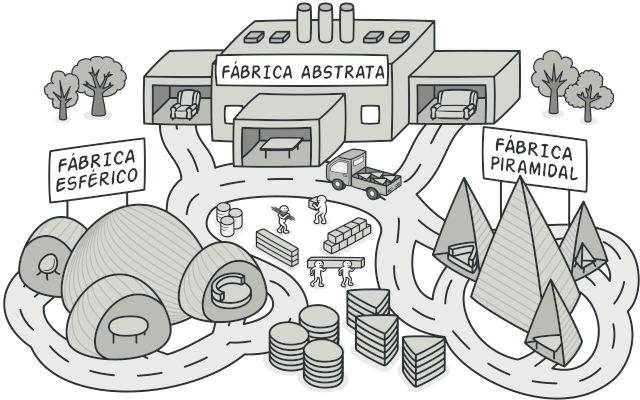

## Abstract Factory

O Abstract factory é um padrão criacional semelhante ao factory method, porém ainda mais flexível, já que além de uma interface pai para criar subclasses, o abstract factory utiliza de mais interfaces para a criação de famílias diferentes de objetos de uma mesma subclasse.



Vamos seguir no exemplo da fábrica de carro anterior, mas vamos olhar mais de perto a fábrica de uma montadora apenas. Imagine a [fábrica da Fiat ](./FabricaFiat.java) que implementa uma interface [FabricaDeCarro](./FabricaFiat.java). Essa fábrica pode criar carros de tipos diferentes, por exemplo o argo que é um hatch, e o siena que é um sedan. E para isso ela utiliza de outras interfaces para cada tipo, ou família, de carro: [CarroHatch](./CarroHatch.java) e [CarroSedan](./CarroSedan.java).

Acompanhe o código:
Uma interface para a construção de fábricas de carros:
```
public interface FabricaDeCarro {
  CarroSedan criarCarroSedan();
  CarroHatch criarCarroHatch();
  
}
```
Note que temos que definir mais métodos, já que estabelecemos tipos de carros diferentes!

A fabrica fiat que implementa a interface acima:
```
public class FabricaFiat implements FabricaDeCarro{
  @Override
  public CarroSedan criarCarroSedan(){
    return new Siena();
  } 

  @Override
  public CarroHatch criarCarroHatch(){
    return new Argo();
  }
}
```

Também temos que definir as interfaces para os tipos de carros a serem construídos, ou seja, a interface para o carro sedan e hatch:
```
public interface CarroHatch{
  void exibirInfoHatch();
}

public interface CarroSedan{
  void exibirInfoSedan();
}
```

E agora para finalizar, definimos as classes do Argo que é um carro hatch, e do siena que é um carro sedan:
```
public class Argo implements CarroHatch{
  @Override
  public void exibirInfoHatch(){
    System.out.println("modelo: argo");
    System.out.println("fab: fiat");
    System.out.println("cat: hatch");
  }
}

public class Siena implements CarroSedan{
  @Override
  public void exibirInfoSedan(){
    System.out.println("modelo: siena");
    System.out.println("fabricante: fiat");
    System.out.println("cat: sedan");
  }
} 
```
Esse padrão foi testado no [Cliente](./Cliente.java)!

Com esse padrão temos mais flexibilidade ainda para a construção de cadeias de produção inteiras, sem precisarmos alterar código mesmo quando ocorra uma grande hierarquia de classes no sistema!
Isso permite uma grande escalabilidade e adição de novas features em um sistema complexo!

E levando em consideração os princípios SOLID, cada classe deve ter apenas um propósito, então em sistemas maiores teremos um grande número de classes, e esse padrão facilita o desenvolvimento das mesmas!

Normalmente vários projetos começam utilizando o [Factory Method](../Factory_Method/), porém com o desenvolvimento e crescimento do projeto, acabam implementadno o Abstract factory, que é muito mais flexível, embora mais complexo!

###### Caso queira ver a implementação desse padrão em outra linugagem e de maneira mais concisa e aprofundada, recomendo o site [Refactoring Guru](https://refactoring.guru/pt-br), que possui um acervo de muitos design patterns e suas implementações em diversas linguagens com vários exemplos!!!!