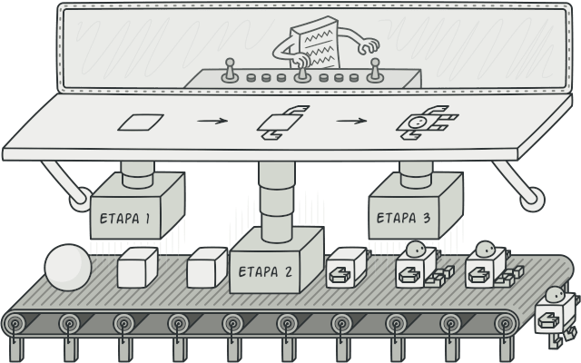

## Builder

O builder é um padrão criacional que facilita e modulariza a criação de objetos complexos que variam em suas representações. Utilizando de uma classe própria `Builder` que possue métodos organizados em etapas para finalizar um objeto complexo a ser construído.



Vamos também utilizar como exemplo a industria automotiva. Uma montadora monta diversos carros com diversas características, e criar uma classe para cada variação de modelo de modelos diferentes não é uma maneira muito otimizada. Então utilizamos o padrao Builder, criando uma classe abstrata [CarroBuilder](./CarroBuilder.java) que vai lidar com cada característica como preço, ano, modelo, de maneira otimizada e modularizada:

```
public abstract class CarroBuilder {
    protected CarroProduct carro = new CarroProduct();
    public abstract void buildPreco();
    public abstract void buildDscMotor();
    public abstract void buildAnoDeFabricacao();
    public abstract void buildModelo();
    public abstract void buildMontadora();
    public CarroProduct getCarro(){
        return carro;
    };
}
```

Note que há um método para cada característica do carro, organizando assim a construção do carro em um passo a passo.

Também definimos a classe do [CarroProduct](./CarroProduct.java):

```
public class CarroProduct {
    public double preco;
    public String dscMotor;
    public int anoDeFabricacao;
    public String modelo;
    public String montadora;
}
```

Agora criamos uma classe [ConcessionariaDirector](./ConcessionariaDirector.java) que vai encapsular toda essa lógica apresentada, algo semelhante à uma Facade, para lidar com a construção de um carro:

```
public class ConcessionariaDirector {
    protected CarroBuilder montadora;

    public ConcessionariaDirector(CarroBuilder montadora) {
        this.montadora = montadora;
    }

    public void construirCarro() {
        montadora.buildPreco();
        montadora.buildAnoDeFabricacao();
        montadora.buildDscMotor();
        montadora.buildModelo();
        montadora.buildMontadora();
    }

    public CarroProduct getCarro() {
        return montadora.getCarro();
    }
}
```

Para um exemplo prático criamos um builder [FiatBuilder](./FiatBuilder.java) que implementa o CarroBuilder e define os métodos das características:

```
public class FiatBuilder extends CarroBuilder {
    @Override
    public void buildPreco() {
        carro.preco = 1000.00;
    }
    @Override
    public void buildDscMotor() {
        carro.dscMotor = "1.0 Flex";
    }
    @Override
    public void buildAnoDeFabricacao() {
        carro.anoDeFabricacao = 2010;
    }
    @Override
    public void buildModelo() {
        carro.modelo = "Palio";
    }
    @Override
    public void buildMontadora() {
        carro.montadora = "Fiat";
    }
}
```

No exemplo [Cliente](./Cliente.java) também implementamos o padrão builder em uma classe [VolksBuilder](./VolksBuilder.java) e testamos sua funcionalidade.

Assim, dividindo o processo de criação de objetos complexos com o método Builder, temos a flexibilidade para construir diversos objetos diferentes ao invés de se manter preso há um padrão específico.
Além disso, o encapsulamento garantido pela classe builder torna o código mais legível e menos complexo no nível de utilização.
Esse padrão também fornece, como visto no exemplo, a reutilização de código, já que implementamos em duas classes diferentes.

###### Caso queira ver a implementação desse padrão em outra linugagem e de maneira mais concisa e aprofundada, recomendo o site [Refactoring Guru](https://refactoring.guru/pt-br), que possui um acervo de muitos design patterns e suas implementações em diversas linguagens com vários exemplos!!!!