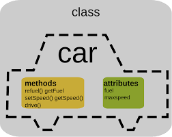
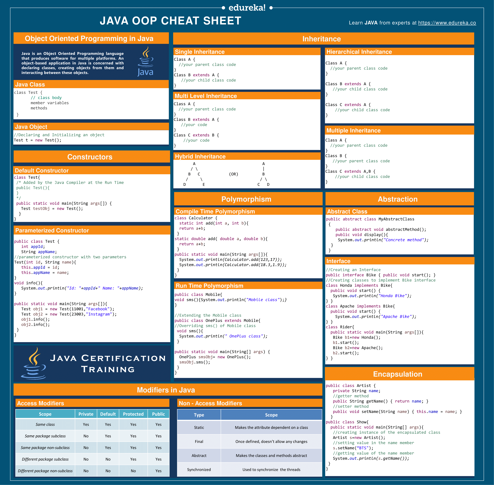

# Programação Orientada a Objetos com Java
A Programação Orientada a Objetos (POO) é um paradigma de programação que se concentra na criação de objetos que possuem propriedades e comportamentos. Em POO, um objeto é uma instância de uma classe, que é uma estrutura que define as propriedades e comportamentos do objeto. Em uma classe temos atributos, como variáveis, e métodos, comportamentos, com funções. 

Normalmente uma classe é uma abstração de algum objeto real, como uma Pessoa, possuindo atributos que uma pessoa tem!!

A abstração é um conceito importante e um pilar na programação orientada a objetos que consiste em simplificar e generalizar os detalhes complexos de um sistema, focando apenas nos aspectos importantes para a tarefa que estamos realizando.

### Classes

Para criar uma classe em Java, usamos a palavra-chave class seguida pelo nome da classe e um conjunto de chaves que contém as propriedades e métodos da classe. Aqui está um exemplo simples de uma classe Pessoa:
```
public class Pessoa {
    public String nome;
    public int idade;
    
    public Pessoa(String nome, int idade) {
        this.nome = nome;
        this.idade = idade;
    }
    public void Falar(){
        System.out.println("Olá, eu me chamo "+this.nome);
    }
}
```
Nesse exemplo temos a classe pessoa, tendo nome e idade como atributos, além de um comportamento `Falar()` onde ela printa seu nome, além de seu construtor definido.

###### Exemplo ilustrativo Classe carro:


#### Construtores
 Um construtor é um método especial em uma classe que é usado para criar e inicializar objetos daquela classe. Ele é chamado automaticamente quando um novo objeto é criado e é usado para definir os valores iniciais das propriedades do objeto.

 

Em Java, um construtor é definido como um método com o mesmo nome da classe e sem um tipo de retorno. Como no exemplo da classe acima:
```
    public Pessoa(String nome, int idade) {
        this.nome = nome;
        this.idade = idade;
    }
```
Para criar um objeto a partir de uma classe, usamos a palavra-chave new seguida pelo nome da classe e um conjunto de parênteses que contém os argumentos necessários para o construtor da classe. Aqui está um exemplo simples de criação de um objeto Pessoa e a execução do método Falar:
```
Pessoa pessoa1 = new Pessoa("Lucas", 30);
pessoa1.Falar();

```
###### Uma classe pode ter um como atributo, um objeto de outro classe, e acessar seus atributos e métodos (Com exemplos de código):
 Por exemplo na classe [Ingresso](intro_classes_obj/Ingresso.java), um de seus atributos é um objeto da classe [Cliente](intro_classes_obj/Cliente.java), e assim ao executar o método `imprimeIngresso()`, a classe ingresso acessa os atributos do seu Cliente!!  *How cool is that?!*

 ### Encapsulamento
 O encapsulamento é outro conceito importante da programação orientada a objetos que consiste em esconder a implementação interna de um objeto, protegendo seus atributos e métodos de acessos indevidos ou não autorizados.

Em Java, o encapsulamento é implementado por meio da definição de atributos como privados e do uso de métodos públicos (conhecidos como getters e setters) para acessá-los e modificá-los. Isso garante que somente as partes autorizadas possam manipular os atributos de um objeto, mantendo a integridade do sistema.

Aqui está um exemplo simples de encapsulamento em Java:
```
public class ContaBancaria {
    private String titular;
    private double saldo;
    
    public ContaBancaria(String titular, double saldo) {
        this.titular = titular;
        this.saldo = saldo;
    }
    
    public String getTitular() {
        return titular;
    }
    
    public double getSaldo() {
        return saldo;
    }
    
    public void depositar(double valor) {
        saldo += valor;
    }
    
    public void sacar(double valor) {
        if (saldo >= valor) {
            saldo -= valor;
        }
    }
}
```
Nesse exemplo, a classe ContaBancaria tem dois atributos privados (titular e saldo) e quatro métodos públicos (getTitular, getSaldo, depositar e sacar). Os métodos getTitular e getSaldo são getters que retornam o valor dos atributos privados, enquanto depositar e sacar são setters que modificam o valor do atributo saldo.

Dessa forma, o acesso aos atributos titular e saldo é restrito aos métodos da classe ContaBancaria, garantindo que eles não possam ser modificados ou acessados indevidamente por outras partes do sistema.

###### Um outro exemplo é nessa classe [Pessoa](encapsulamento/ex01/Pessoa.java), onde seus atributos são privados e só se tem acesso através de getters e setters.


O encapsulamento fornece uma camada de segurança nas classes, além de facilitar a manutenção.

**Além disso temos os modificadores de acesso:**

Em Java, existem três modificadores de acesso que podem ser usados para definir a visibilidade de atributos, métodos e classes em um programa. São eles:

1. public: Um membro definido com o modificador public é acessível por qualquer classe em qualquer pacote. Ou seja, o membro pode ser acessado por qualquer objeto em qualquer lugar do programa.

2. protected: Um membro definido com o modificador protected é acessível pelas classes do mesmo pacote e também pelas subclasses (herdeiras) em qualquer pacote. Ou seja, o membro pode ser acessado somente pelas classes que estão no mesmo pacote e também pelas classes que herdam da classe que contém o membro.

3. private: Um membro definido com o modificador private é acessível apenas pela classe que o contém. Ou seja, o membro só pode ser acessado dentro da própria classe e não pode ser acessado por outras classes, mesmo que estejam no mesmo pacote ou sejam subclasses.

###### Podemos ver um exemplo de cada modificador aqui -> [Exercício de modificadores de Acesso](encapsulamento/ex02/), onde temos 3 classes, cada uma com um dos modificadores acima, e um programa de teste que tenta alterar os atributos diretamente.

### Herança
Herança é um dos principais conceitos da Programação Orientada a Objetos (POO) e permite que uma classe herde características (atributos e métodos) de outra classe. Na herança, a classe que é herdada é chamada de classe pai ou superclasse, e a classe que herda é chamada de classe filha ou subclasse.


A subclasse é capaz de acessar os atributos e métodos da superclasse, bem como adicionar novos atributos e métodos. Além disso, a subclasse pode substituir os métodos da superclasse por métodos com o mesmo nome e mesma assinatura, porém com implementações diferentes.

Para definir uma relação de herança em Java, utiliza-se a palavra-chave extends. Por exemplo:
```
public class Pessoa {
    protected String nome;
    protected int idade;

    public Pessoa(String nome, int idade) {
        this.nome = nome;
        this.idade = idade;
    }

    public void apresentar() {
        System.out.println("Olá, meu nome é " + this.nome + " e eu tenho " + this.idade + " anos.");
    }
}

public class Aluno extends Pessoa {
    private String curso;

    public Aluno(String nome, int idade, String curso) {
        super(nome, idade);
        this.curso = curso;
    }

    public void apresentar() {
        super.apresentar();
        System.out.println("Eu sou um aluno do curso de " + this.curso + ".");
    }
}
```
Neste exemplo, temos uma classe Pessoa que tem dois atributos (nome e idade) e um método apresentar() que imprime o nome e idade da pessoa. A classe Aluno herda da classe Pessoa com a palavra-chave extends e adiciona um novo atributo curso. Além disso, a classe Aluno sobrescreve o método apresentar() para imprimir também o curso do aluno.

Assim, a classe Aluno tem acesso aos atributos e métodos da classe Pessoa, além de ter seus próprios atributos e métodos. Dessa forma, a herança permite a reutilização de código e ajuda a criar uma hierarquia de classes mais organizada. Como complemento temos as classes abstratas.

##### Classes Abstratas
A classe abstrata é uma forma de aplicar a herança em um nível mais abstrato, definindo comportamentos genéricos que serão herdados pelas subclasses.


Ao criar uma classe abstrata, podemos definir métodos abstratos que as subclasses deverão implementar obrigatoriamente. Isso garante que as subclasses tenham um comportamento específico, mas também garante que elas tenham uma estrutura comum e reutilizável. A classe abstrata, portanto, é uma forma de definir um esqueleto genérico para as subclasses.

Classe abstrata é uma classe que não pode ser instanciada, ou seja, não é possível criar objetos diretamente a partir dela. Ela é utilizada como uma classe base para outras classes, que estendem essa classe abstrata, assim como ocorre na herança.

A principal diferença entre uma classe abstrata e uma classe concreta é que a classe abstrata pode conter métodos abstratos, que são métodos sem implementação. As subclasses que herdam dessa classe abstrata são obrigadas a implementar esses métodos abstratos, caso contrário também devem ser declaradas como abstratas.

Na prática, a classe abstrata é utilizada como um esqueleto, que define os métodos que suas subclasses devem implementar, e também pode conter implementações genéricas de métodos que serão herdados pelas suas subclasses.

Por exemplo, podemos criar uma classe abstrata Animal com um método abstrato emitirSom() e uma classe concreta Cachorro que estende a classe Animal e implementa o método emitirSom(), além de possuir seus próprios atributos e métodos:
```
abstract class Animal {
    protected String nome;
    protected int idade;

    public Animal(String nome, int idade) {
        this.nome = nome;
        this.idade = idade;
    }

    public abstract void emitirSom();

    public void andar() {
        System.out.println("O " + nome + " está andando.");
    }
}

class Cachorro extends Animal {
    public Cachorro(String nome, int idade) {
        super(nome, idade);
    }

    @Override
    public void emitirSom() {
        System.out.println("O " + nome + " está latindo.");
    }

    public void abanarRabo() {
        System.out.println("O " + nome + " está abanando o rabo.");
    }
}
```
Neste exemplo, a classe Animal é uma classe abstrata que contém um método abstrato emitirSom(), que será implementado pelas subclasses. A classe Cachorro herda da classe Animal e implementa o método abstrato emitirSom() de acordo com o comportamento específico de um cachorro. A classe Cachorro também possui um método abanarRabo(), que é específico desta subclasse.

Note que, como a classe Animal é abstrata, ela não pode ser instanciada diretamente. Já a classe Cachorro é uma classe concreta, que pode ser instanciada normalmente. Dessa forma, a classe abstrata Animal serve como um esqueleto para outras classes que herdam dela, definindo métodos e atributos comuns a todas as subclasses, enquanto as classes concretas específicas implementam seus próprios comportamentos.

###### Além das classes abstratas temos as interfaces, que podem parecer semelhantes mas tem funções diferentes:

##### Interfaces
Uma interface em Java é uma espécie de contrato que define um conjunto de métodos que uma classe que a implementa deve implementar. É uma forma de definir um conjunto de comportamentos que uma classe deve ter sem se preocupar com a implementação específica desses comportamentos.

Em outras palavras, uma interface é uma lista de métodos abstratos (métodos sem implementação) que uma classe que implementa essa interface deve definir. Além disso, uma interface pode definir constantes (atributos que não mudam de valor) e métodos padrão (métodos com implementação padrão que podem ser sobrescritos).

Por exemplo, podemos ter uma interface Voador que define um método voar(). Qualquer classe que implemente a interface Voador deve implementar o método voar(). Se temos classes diferentes, como Pássaro, Avião e Helicóptero, que possuem a capacidade de voar, todas podem implementar a interface Voador. Dessa forma, podemos tratar esses objetos como Voador sem se preocupar com a implementação específica de cada um.

As interfaces são úteis porque permitem que as classes compartilhem um comportamento comum sem ter que compartilhar uma hierarquia de classes comum. Além disso, as interfaces podem ser usadas para implementar a programação orientada a contratos, que ajuda a garantir que as classes cumpram um conjunto definido de comportamentos.
```
public interface Voador {
   void voar();
}

public class Pássaro implements Voador {
   @Override
   public void voar() {
      System.out.println("O pássaro está voando.");
   }
}
```
###### Como exemplo temos este exercício -> [EX!](herança_interface/) Onde implementamos a interface FormaGeometrica com métodos que retornam a area e o perimetro. E também temos duas classes Circulo e Quadrado, que implementam a interface FormaGeometrica e possuem os metodos dela, porém as duas definem os métodos de maneiras diferentes, onde entra o Polimorfismo.


Ufaaa! Se você chegou até aqui parabéns você consumiu MUITA informação..... Vou disponibilizar aqui um cheatsheet que ajuda muito, (já que vc ja entendeu os conceitos!):

